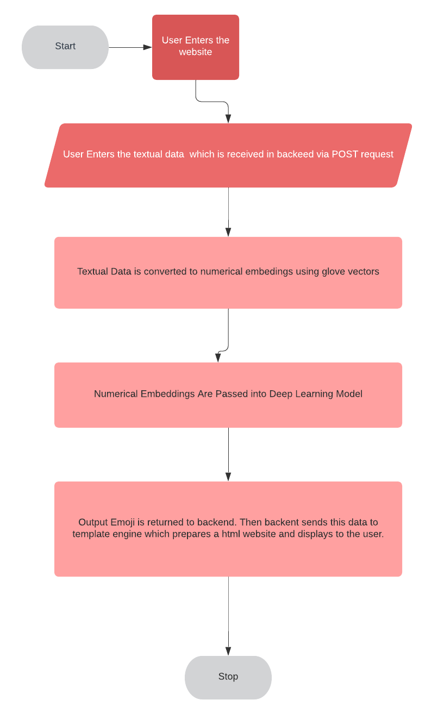
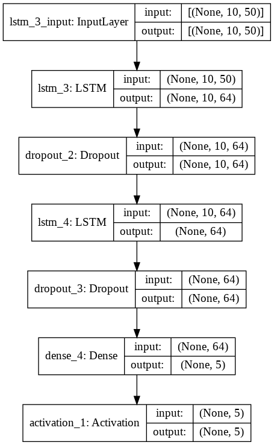
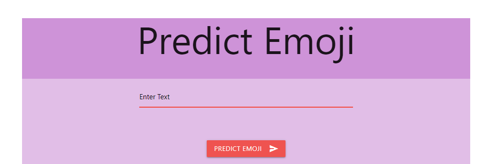
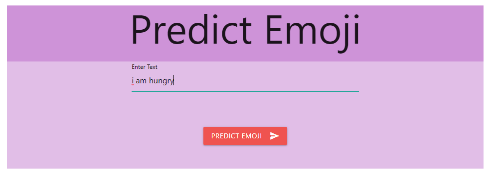
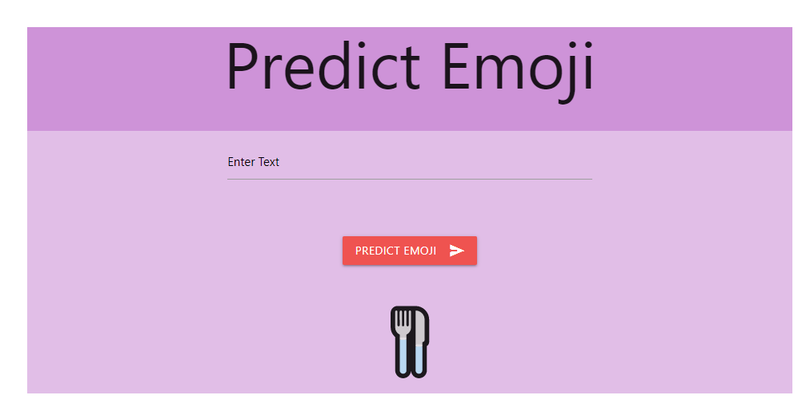

# Emojifier Project

## About the Project 
- This project aims to build efficient and light deep learning model that predicts the emoji from given input text.
- For Demo Purposes we have deployed it in heroku with link (http://arcane-badlands-01233.herokuapp.com/)

## How to run the project ?
- virtualenv env 
- env/scripts/activate
- pip install -r requirements.txt
- Download the embeddings file which needs to be present in emojifier_DeepLearningCode/embedding/ with name "glove.6B.50d.txt"
-python manage.py runserver 

## Files Description
### emojifier_DeepLearningCode/
This folder contains the deep learning portion of the project.
- emojifier_DeepLearningCode/dataset : this contains sample dataset which was used for training 
- emojifier_DeepLearningCode/embedding : this folder should contain the glove vector embedding.(refer readme.txt to download)
- emojifier_DeepLearningCode/trainedModel : trained model weights and architecture get saved here 
- emojifier_DeepLearningCode/train.py : training code to train a deep learning model
- emojifier_DeepLearningCode/predict.py : this is used to make predictions using trained model

### emojifierProject/
This folder contains the files which are needed to spin up django server

### main/
This contains the django application which contains the views and urls for our project

### templates/
It contains the frontend templates used in the project 

## Flow Chart
 

## Methodology
- The input text is converted to embeddings using glove vector embeddings.
- These numerical embeddings are then passed through deep learning model.
- The deep learning model output probablity of 5 emojis.

## Network Architecture 

## I/O Screenshots 

